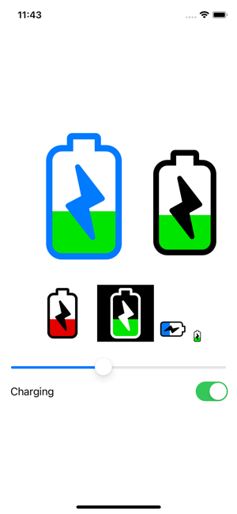

# LNSBatteryLevel

A SwiftUI battery charge level view.



## Installation

Add the LNSBatteryLevel swift package to your project:

  `https://github.com/alldritt/LNSBatteryLevel.git`

## Usage

LNSBatteryLevel is a view you can combine with other SwiftUI views to add a battery charge indicator to your application:


```
import SwiftUI
import LNSBatteryLevel

struct ContentView: View {
    @State var level = CGFloat(0.2)
    @State var charging = false

    var body: some View {
        VStack {
            LNSBatteryLevel(level: $level, charging: $charging, borderColor: .blue)
                .frame(width: 200, height: 200)
                .padding()
            Slider(value: $level)
            Toggle("Charging", isOn: $charging)
        }
        .padding()
    }
}
```

## Example App

An example application is included illustrating some of the ways the LNSBatteryLevel view can be customized.

